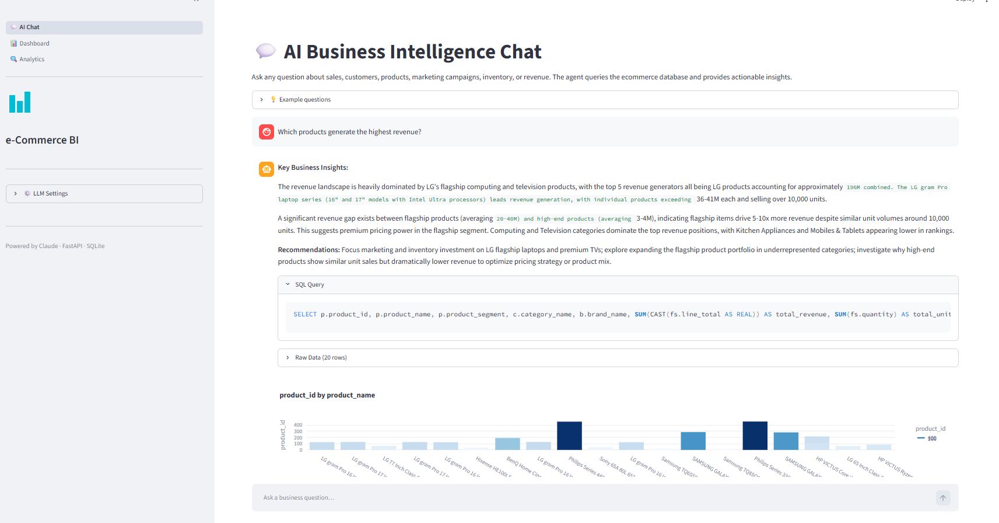
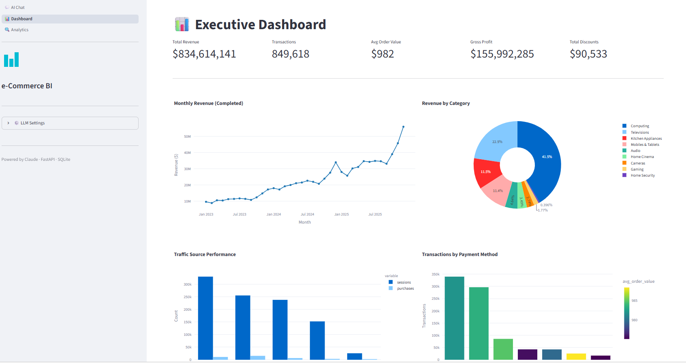
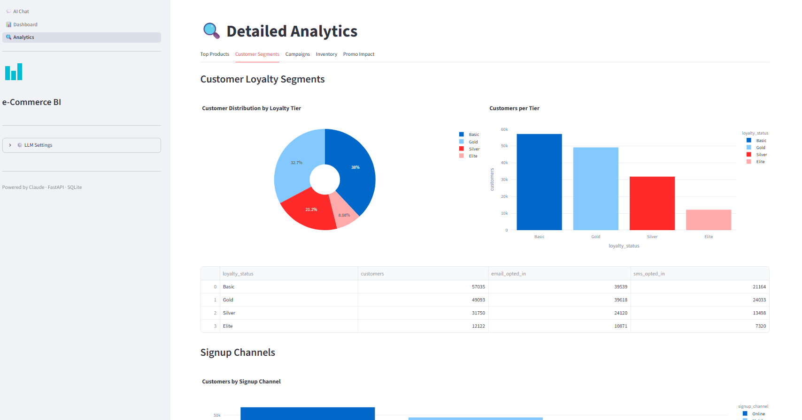

# 📊 e-Commerce BI Agent

> **AI-powered Business Intelligence for retail analytics — ask questions in plain English, get SQL-backed insights instantly.**


### What is this?

The **e-Commerce BI Agent** turns natural-language business questions into SQL queries, executes them against a retail database, and returns concise, meaningful insights.

Beyond the chat interface, it includes a **live executive dashboard** and **deep-dive analytics reports** so analysts and non-technical stakeholders can explore the same data through pre-built charts and KPIs.

| | |
|---|---|
| 🗣️ **Ask anything** | "Which products drive the most revenue this quarter?" |
| ⚡ **Instant answers** | Claude writes the SQL, runs it, and explains the result |
| 📊 **Ready-made dashboards** | Revenue trends, channel performance, campaign ROI |
| 🔌 **Flexible LLM backend** | Direct Anthropic API or corporate gateway (Bedrock + Keycloak) |

Built with **Claude**, **FastAPI**, and **Streamlit**, powered by the [ElecMart Retail Analytics Dataset](https://www.kaggle.com/datasets/ajibsss/elecmart-retail-analytics-dataset?resource=download).

---

## Architecture

```
┌─────────────────────────────┐        ┌───────────────────────────────────┐
│  Streamlit Frontend((Port 8501) )    │  HTTP  │  FastAPI Backend (Port 8000)│
│  frontend/app.py             │◄──────►│  ecommerce-backend/main.py        │
│                              │        │                                   │
│  Pages:                      │        │  Routers:                         │
│  • 💬 AI Chat                │        │  /api/chat      — AI Q&A pipeline │
│  • 📊 Dashboard              │        │  /api/analytics — Pre-built KPIs  │
│  • 🔍 Analytics              │        │  /api/config    — Runtime LLM cfg │
│                                                                           │
└─────────────────────────────┘         │  Services:                        │
                                        │  ai_service.py  — LLM + SQL logic │
                                        │                                   │
                                        │  Database:                        │
                                        │  ecommerce.db (SQLite)            │
                                        └───────────────────────────────────┘
                                                      │
                                          ┌───────────┴───────────┐
                                          │  LLM Gateway (optional)│
                                          │  Keycloak → Bearer     │
                                          │  Bedrock-format POST   |
                                          │        OR Claude API   |
                                          └───────────────────────┘
```

---

## Features

### 💬 AI Chat
Natural-language questions answered end-to-end:
1. Claude generates a SQL query from the question
2. Query is executed against the SQLite database
3. Claude analyses the results and returns business insights
4. Conversation history is maintained for follow-up questions

### 📊 Dashboard
Pre-built KPI cards and charts:
- Total revenue, sales by category, Customer segments and loyalty breakdown

### 🔍 Analytics
Deep-dive analytics panels:
- Top products
- Campaign and promotion performance
- Inventory status and device breakdown

### ⚙️ LLM Settings (sidebar)
Switch between connection modes at runtime without restarting:
| Mode | When to use |
|---|---|
| **Direct Anthropic API** | Local development with your own API key |
| **Custom LLM Gateway** | Corporate deployment via a Bedrock-compatible gateway with Keycloak auth |

---

## Quick Start

### Prerequisites
- Python 3.11+
- An Anthropic API key **or** access to a corporate LLM gateway

### 1. Clone & install dependencies (Recommended to create python virtual env)

```bash
git clone <repo-url>
cd business-intelligence-agent-claude

# Backend
cd ecommerce-backend
pip install -r requirements.txt

# Frontend
cd ../frontend
pip install -r requirements.txt
```

### 2. Configure environment

Copy and edit the backend environment file:

```bash
cd ecommerce-backend
cp .env.example .env   # or create .env manually
```

**Direct Anthropic API (simplest):**
```env
DATABASE_URL=sqlite:///./ecommerce.db
LLM_API_KEY=sk-ant-...
CLAUDE_MODEL=claude-3-5-sonnet-20241022
ALLOWED_ORIGINS=http://localhost:8501
```

**Corporate LLM Gateway (Bedrock-compatible + Keycloak):**
```env
DATABASE_URL=sqlite:///./ecommerce.db
LLM_BASE_URL=https://llm-gw.corp.com
LLM_API_KEY=<gateway-api-key>
CLAUDE_MODEL=<model name>

# Keycloak (ROPC grant)
KEYCLOAK_URL=https://auth.corp.com/realms/MyRealm/protocol/openid-connect/token
CLIENT_ID=<client-id>
CLIENT_SECRET=<client-secret>
llm_username=<service-account-username>
llm_password=<service-account-password>

ALLOWED_ORIGINS=http://localhost:8501
```

### 3. Populate the database

```bash
cd ecommerce-backend
python populate_db.py
```

### 4. Start the backend

```bash
cd ecommerce-backend
uvicorn main:app --reload --port 8000
```

API docs available at [http://localhost:8000/docs](http://localhost:8000/docs).

### 5. Start the frontend

```bash
cd frontend
streamlit run app.py
```

Open [http://localhost:8501](http://localhost:8501) in your browser.

---

## Project Structure

```
business-intelligence-agent-claude/
├── ecommerce-backend/
│   ├── main.py                     # FastAPI app entry point
│   ├── populate_db.py              # Database seeding script
│   ├── ecommerce.db                # SQLite database (generated)
│   ├── .env                        # Environment config (not committed)
│   └── app/
│       ├── database/
│       │   └── database.py         # SQLAlchemy engine setup
│       ├── models/
│       │   └── models.py           # ORM table definitions
│       ├── routers/
│       │   ├── analytics.py        # Pre-built analytics endpoints
│       │   ├── chat.py             # AI chat endpoint
│       │   └── config.py           # Runtime LLM config endpoint
│       └── services/
│           └── ai_service.py       # LLM gateway + SQL pipeline
├── frontend/
│   ├── app.py                      # Streamlit entry point & sidebar
│   └── pages/
│       ├── api.py                  # Backend API helpers
│       ├── 1_ai_chat_page.py       # AI chat UI
│       ├── 2_dashboard_page.py     # KPI dashboard
│       ├── 3_analytics_page.py     # Deep-dive analytics
├── kaggle_dataset/                 # Source CSV files
└── agent.skills.md                 # Agent capability reference
```

---

## API Reference

| Method | Path | Description |
|---|---|---|
| `POST` | `/api/chat` | Submit a business question; returns SQL, data rows, and AI analysis |
| `GET` | `/api/analytics/revenue-summary` | Top-line revenue KPIs |
| `GET` | `/api/analytics/revenue-trend` | Monthly revenue series |
| `GET` | `/api/analytics/top-products` | Top N products by revenue |
| `GET` | `/api/analytics/sales-by-category` | Revenue by product category |
| `GET` | `/api/analytics/channel-effectiveness` | Traffic source conversion rates |
| `GET` | `/api/analytics/campaign-performance` | Campaign revenue and ROI |
| `GET` | `/api/analytics/promo-impact` | Promotion discount impact |
| `GET` | `/api/analytics/inventory-status` | Stock levels by product |
| `GET` | `/api/config` | Get current LLM configuration |
| `POST` | `/api/config` | Update LLM configuration at runtime |
| `GET` | `/api/health` | Health check |

Full interactive documentation: [http://localhost:8000/docs](http://localhost:8000/docs)

---

## Database Schema

The SQLite database contains ~17 million rows across fact and dimension tables modelling a retail business.

| Table | Rows (approx.) | Description |
|---|---|---|
| `fact_clickstream` | 14.5 M | Web session activity |
| `fact_transaction` | 900 K | Order headers |
| `fact_sale` | 1.8 M | Order line items |
| `fact_inventory` | — | Monthly stock snapshots |
| `dim_customer` | — | Customer demographics |
| `dim_product` | — | Product catalogue |
| `dim_store` | — | Store details |
| `dim_campaign` | — | Marketing campaigns |
| `dim_promotion` | — | Promotion rules |

---
## Example of AI-powered Business Intelligence Analyst 
Answer Questions and Understand Insights




## LLM Gateway Integration

When `LLM_BASE_URL` is set the service:

1. Obtains a Bearer token from Keycloak using the **Resource Owner Password Credentials** grant
2. Wraps each LLM call in a Bedrock-compatible envelope:

```json
{
  "method": "POST",
  "llm_provider": "bedrock",
  "llm_model": "<model-name>",
  "action": "converse",
  "stream": false,
  "llm_payload": {
    "system": [{ "text": "<system-prompt>" }],
    "messages": [{ "role": "user", "content": [{ "text": "<question>" }] }],
    "inferenceConfig": { "temperature": 0.0, "maxTokens": 1024 }
  }
}
```

3. Tokens are cached in-memory and refreshed automatically 30 seconds before expiry.

---

## Dataset Credit

[ElecMart Retail Analytics Dataset](https://www.kaggle.com/datasets/ajibsss/elecmart-retail-analytics-dataset?resource=download) — Kaggle
